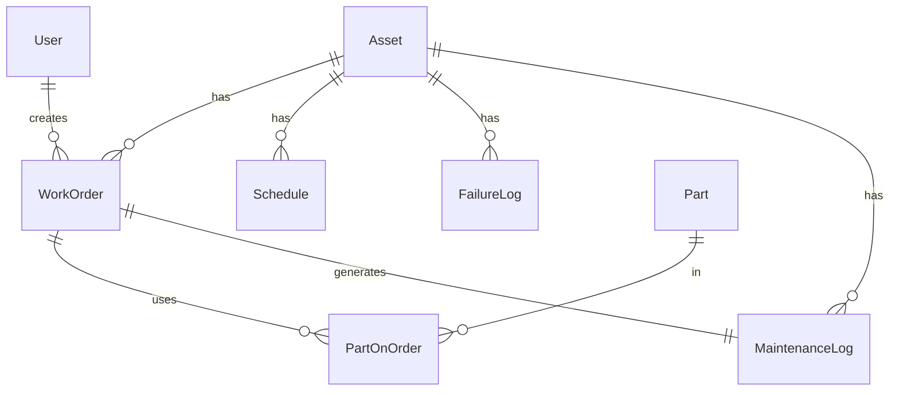

# Arquitectura del Sistema CMMS Plastics Pro

## 🏗️ Visión General

CMMS Plastics Pro está construido siguiendo los principios de **Clean Architecture** y **SOLID**, utilizando Next.js 14 con App Router para aprovechar las capacidades de Server Components y Server Actions.

## 📐 Capas de la Arquitectura

```
┌─────────────────────────────────────────┐
│     Presentation Layer (UI)             │
│  - React Server Components              │
│  - Client Components                    │
│  - Layouts & Pages                      │
├─────────────────────────────────────────┤
│     Application Layer (API)             │
│  - API Routes                           │
│  - Server Actions                       │
│  - Business Logic                       │
├─────────────────────────────────────────┤
│     Domain Layer                        │
│  - Entities (Prisma Models)             │
│  - Types & Interfaces                   │
│  - Validation Schemas (Zod)             │
├─────────────────────────────────────────┤
│     Infrastructure Layer                │
│  - Database (PostgreSQL + Prisma)       │
│  - External Services                    │
│  - File Storage                         │
└─────────────────────────────────────────┘
```

## 🗂️ Estructura de Carpetas

```
src/
├── app/                          # Next.js App Router
│   ├── (auth)/                   # Grupo de rutas de autenticación
│   ├── dashboard/                # Rutas del dashboard
│   │   ├── page.tsx              # Dashboard principal
│   │   ├── layout.tsx            # Layout compartido
│   │   ├── work-orders/          # Módulo de órdenes
│   │   ├── assets/               # Módulo de activos
│   │   ├── inventory/            # Módulo de inventario
│   │   └── schedule/             # Módulo de programación
│   ├── api/                      # API Routes
│   │   └── work-orders/
│   │       └── route.ts
│   ├── layout.tsx                # Root layout
│   └── globals.css               # Estilos globales
│
├── components/                   # Componentes React
│   ├── ui/                       # Componentes base (shadcn/ui)
│   │   ├── button.tsx
│   │   ├── card.tsx
│   │   ├── input.tsx
│   │   └── ...
│   ├── layout/                   # Componentes de layout
│   │   ├── main-nav.tsx
│   │   └── user-nav.tsx
│   ├── dashboard/                # Componentes del dashboard
│   │   ├── dashboard-stats.tsx
│   │   ├── maintenance-chart.tsx
│   │   └── ...
│   ├── work-orders/              # Componentes de OT
│   ├── assets/                   # Componentes de activos
│   ├── inventory/                # Componentes de inventario
│   └── schedule/                 # Componentes de programación
│
└── lib/                          # Utilidades y configuración
    ├── prisma.ts                 # Cliente de Prisma
    ├── utils.ts                  # Funciones auxiliares
    └── validations/              # Schemas de validación
```

## 🔄 Flujo de Datos

### Server Components (Lectura)
```
Page (RSC) → Prisma Query → Database → Render HTML → Client
```

### Client Components (Escritura)
```
User Action → API Route → Prisma Mutation → Database → Response → Revalidate
```

## 🗄️ Modelo de Datos

### Relaciones Principales



### Enums

- **UserRole**: ADMIN, SUPERVISOR, TECHNICIAN
- **AssetArea**: EXTRUSION, PRINTING, SEALING, AUXILIARY
- **OrderType**: PREVENTIVE, CORRECTIVE, PREDICTIVE
- **Status**: OPEN, IN_PROGRESS, ON_HOLD, CLOSED
- **Priority**: LOW, MEDIUM, HIGH, CRITICAL
- **FrequencyType**: CALENDAR, USAGE_HOURS, USAGE_METERS

## 🔐 Autenticación y Autorización

### NextAuth.js
- JWT Strategy
- Credentials Provider
- Session Management
- Role-based Access Control (RBAC)

### Roles y Permisos

| Rol | Permisos |
|-----|----------|
| **ADMIN** | Acceso completo, gestión de usuarios |
| **SUPERVISOR** | Ver reportes, aprobar OT, gestionar inventario |
| **TECHNICIAN** | Crear/editar OT, reportar fallas, ver activos |

## 📊 Cálculo de KPIs

### OEE (Overall Equipment Effectiveness)
```typescript
OEE = Disponibilidad × Rendimiento × Calidad

Disponibilidad = (Tiempo Operativo / Tiempo Planificado) × 100
Rendimiento = (Producción Real / Producción Teórica) × 100
Calidad = (Unidades Buenas / Unidades Totales) × 100
```

### MTBF (Mean Time Between Failures)
```typescript
MTBF = Tiempo Total Operativo / Número de Fallas
```

### MTTR (Mean Time To Repair)
```typescript
MTTR = Σ(Tiempo de Reparación) / Número de Reparaciones
```

### PMP (Porcentaje de Mantenimiento Preventivo)
```typescript
PMP = (OT Preventivas / OT Totales) × 100
```

## 🚀 Optimizaciones de Performance

### Server Components
- Renderizado en el servidor
- Reducción del bundle de JavaScript
- Streaming con Suspense

### Database
- Índices en campos frecuentemente consultados
- Connection pooling
- Query optimization con Prisma

### Caching
- Next.js automatic caching
- Revalidation strategies
- TanStack Query para client-side caching

### Code Splitting
- Dynamic imports
- Route-based splitting
- Component lazy loading

## 🔒 Seguridad

### Implementadas
- ✅ SQL Injection prevention (Prisma ORM)
- ✅ XSS prevention (React auto-escaping)
- ✅ CSRF protection (NextAuth)
- ✅ Password hashing (bcrypt)
- ✅ Environment variables para secrets
- ✅ Input validation (Zod)
- ✅ HTTPS en producción

### Pendientes
- [ ] Rate limiting
- [ ] 2FA (Two-Factor Authentication)
- [ ] Audit logs
- [ ] File upload validation
- [ ] Content Security Policy (CSP)

## 📈 Escalabilidad

### Horizontal Scaling
- Stateless application
- Database connection pooling
- CDN para assets estáticos

### Vertical Scaling
- Database optimization
- Query performance
- Caching strategies

### Microservices (Futuro)
- Separar módulos en servicios independientes
- Message queue (RabbitMQ/Kafka)
- API Gateway

## 🧪 Testing Strategy

### Unit Tests
- Componentes individuales
- Funciones de utilidad
- Validaciones

### Integration Tests
- API Routes
- Database operations
- Authentication flow

### E2E Tests
- User flows críticos
- Playwright/Cypress

## 📦 Deployment

### Vercel (Frontend)
- Automatic deployments
- Preview deployments
- Edge functions

### Railway/Fly.io (Fullstack)
- PostgreSQL managed
- Automatic scaling
- Health checks

### Docker
- Multi-stage builds
- Production-ready image
- Docker Compose para desarrollo

## 🔄 CI/CD Pipeline

```yaml
Commit → GitHub Actions
  ├── Lint & Type Check
  ├── Run Tests
  ├── Build Application
  └── Deploy to Production
```

## 📚 Decisiones Técnicas

### ¿Por qué Next.js 14?
- Server Components para mejor performance
- App Router para routing moderno
- Built-in optimizations
- Excelente DX (Developer Experience)

### ¿Por qué Prisma?
- Type-safe database access
- Migrations automáticas
- Excelente integración con TypeScript
- Prisma Studio para debugging

### ¿Por qué PostgreSQL?
- ACID compliance
- Relaciones complejas
- JSON support
- Escalabilidad probada

### ¿Por qué Tailwind CSS?
- Utility-first approach
- Diseño consistente
- Pequeño bundle size
- Excelente DX

## 🎯 Métricas de Éxito

- ✅ Lighthouse Score > 90
- ✅ First Contentful Paint < 1.8s
- ✅ Time to Interactive < 3.8s
- ✅ 99.9% uptime
- ✅ Response time < 200ms (p95)
- ✅ Zero security vulnerabilities

---

**Última actualización**: 2024
